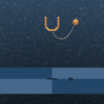
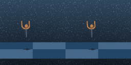

# Dreamer V4 — from-scratch PyTorch reproduction

[](https://arxiv.org/abs/2509.24527)
[](LICENSE)
[](https://huggingface.co/vijayabhaskarev/dreamer-v4)

A faithful, from-scratch PyTorch implementation of **DreamerV4** (Hafner, Yan & Lillicrap, DeepMind, 2025 — [arXiv:2509.24527](https://arxiv.org/abs/2509.24527)): a model-based agent that learns by *imagining* trajectories inside a learned world model. All three phases are implemented and run end-to-end — tokenizer → flow-matching world model → behavior-cloned agent → imagination RL — and evaluated **closed-loop in the real environment**, not just inside imagination.

<p align="center">
  <br>
  <em>The trained agent catching and holding the ball (<code>ball_in_cup_catch</code>, stochastic policy).<br>It learns a real controller — this README is an honest teardown of where offline RL plateaus, and why.</em>
</p>

> **TL;DR.** I reproduced DreamerV4 end-to-end on `ball_in_cup_catch` and ran a rigorous real-env evaluation. The world model + agent learn a real controller (**3–4× a random policy**), but **offline imagination RL ≈ behavior cloning** (p = 0.63) — a clean negative result whose *cause* is an **out-of-distribution state-coverage gap**, not the policy head or mode-averaging. This is a faithful reproduction with honest nulls on a simple task — **not** a SOTA result. The interesting part is the teardown of *why* offline plateaus.

---

## Results — `ball_in_cup_catch` (real-env, closed-loop, n = 50)

50 fixed seeds in the live `dm_control` environment (action_repeat 2, 500 policy steps/episode). All three policies share one world model + reward/continue heads; **only the policy head differs.**

**Catch rate** (fraction of 50 seeds that caught the ball):

| policy | deterministic | stochastic | return (stoch., out of ~1000) |
|---|:---:|:---:|:---:|
| random | 0.10 | 0.10 | 41 |
| behavior cloning (BC) | 0.14 | 0.32 | 162 |
| imagination RL (PMPO) | 0.16 | **0.38** | 247 |

> **These are _offline_ numbers — read them against the demos, not online DreamerV3.** Online DreamerV3 reaches ~0.96 normalized return on cup-catch, but with millions of *self-collected* environment steps. This pipeline never touches the environment during training — it learns from a **fixed, mixed-quality demo set** (mean 0.58 normalized return; 39% expert, 26% genuinely poor). A behavior-cloned policy cannot exceed its data, so the **offline ceiling here is ~0.58, not 0.96.** The catch rates above correspond to normalized return ~0.16 (BC) / ~0.25 (imagination-RL) — roughly **43% of the demo ceiling**, the rest lost to covariate shift. Reaching ~0.9 requires *online* interaction (DAgger / online RL), not more offline training.

**Three findings:**

1. **Trained ≫ random.** Stochastic BC 0.32 / imagination-RL 0.38 vs random 0.10 — the world model + BC learned a genuine controller (3–4× chance). 95% CI ≈ ±0.13 at n=50.
2. **Imagination RL ≈ BC (the null).** Paired sign test, imagination-RL vs BC on the same seeds: **p = 0.63** (stochastic), **p = 1.0** (deterministic). Offline RL inside the world model adds nothing measurable over plain behavior cloning here.
3. **Deterministic collapses, stochastic acts.** Any deterministic readout ≈ 0.15; sampling ≈ 0.38. The policy *knows* the behavior — sampling recovers it — but deterministic deployment freezes.

### Why it plateaus — the diagnosis

The bottleneck is an **OOD state-coverage gap**, *not* the policy head and *not* mode-averaging:
- the belief state is healthy **in-distribution** (its action mean ≈ the demos), and collapses only on **out-of-distribution** states the offline demos never covered;
- an advantage-weighted-BC probe found `corr(return, action-decisiveness) ≈ 0` — the expert is "always-on," so there is no decisive-vs-neutral structure for offline re-weighting to exploit.

Closing that gap is **structurally an online-RL / DAgger problem** — no offline trick (advantage-weighting, longer RL, or a different readout) moved the number, and each of those is tested in the repo.

### Readout ablation (zero-confound: one policy, read three ways; n = 30)

| readout | caught | why |
|---|:---:|---|
| `mean` (Σ pₖ·cₖ) | 0.17 | distribution mean |
| `argmax` (mode) | 0.17 | most-likely bin |
| `sample` | **0.47** | on-policy draw |

`mean ≈ argmax` to the decimal ⇒ the per-state conditionals are ~unimodal, so "deploy the mean, not the mode" **cannot** help. The collapse is the **deterministic-map / OOD-drift** effect — only sampling is robust to it, and the actor was *trained* on sampled actions, so sampling is the training-consistent deployment.

---

## The world model

<p align="center">
  <br>
  <em>Learned flow-matching world model — ground truth (left) vs the model's autoregressive prediction (right), decoded to pixels.</em>
</p>

The dynamics model is a 12-layer block-causal transformer trained with a **flow-matching** objective (+ bootstrap loss + curriculum) to denoise future latents given past latents, actions, and the (τ, d) flow parameters. Agent tokens read the world-model state through an asymmetric attention mask so the policy can be trained without contaminating the frozen world model.

---

## Quickstart — reproduce the result

```bash
git clone https://github.com/vijayabhaskar-ev/dreamer_v4.git && cd dreamer_v4
pip install -r requirements.txt
pip install dm_control mujoco            # for the real-env eval
export MUJOCO_GL=egl                     # headless render (osmesa on CPU-only hosts)

# pull the pretrained checkpoints (~814 MB) from the Hugging Face Hub
hf download vijayabhaskarev/dreamer-v4 --include "ball_in_cup/*" --local-dir checkpoints-hf

# reproduce the headline table (random vs BC vs imagination-RL)
python -m dynamics.evaluate_env \
  --phase2-ckpt    checkpoints-hf/ball_in_cup/agent_bc.pt \
  --phase3-ckpt    checkpoints-hf/ball_in_cup/agent_imagination_rl.pt \
  --tokenizer-ckpt checkpoints-hf/ball_in_cup/tokenizer.pt \
  --task ball_in_cup_catch --action-dim 2 \
  --num-episodes 50 --policies phase3,bc,random \
  --device cuda --readout sample --output-dir eval-stoch     # use --readout argmax for the deterministic column
```

Expected: `random` ≈ 0.10 ≪ `bc` ≈ 0.32 ≈ `phase3` ≈ 0.38 (catch rate). Outputs land in `eval-stoch/` (`summary.json`, per-episode CSV, rollout GIFs).

### Pretrained checkpoints

Hosted on the Hub at [`vijayabhaskarev/dreamer-v4`](https://huggingface.co/vijayabhaskarev/dreamer-v4) — inference-only (optimizer state stripped).

| file | what it is | size |
|---|---|---|
| `ball_in_cup/tokenizer.pt` | masked-autoencoder tokenizer (128×128) | 300 MB |
| `ball_in_cup/agent_bc.pt` | BC agent — world model + categorical policy + reward/continue heads | 507 MB |
| `ball_in_cup/agent_imagination_rl.pt` | imagination-RL policy + value heads (loads **on top of** `agent_bc`) | 7 MB |
| `ball_in_cup/world_model.pt` | world-model base, before agent finetuning — optional, only to retrain the agent | 491 MB |

> Dataset: derived from expert demos in [nicklashansen/dreamer4](https://github.com/nicklashansen/dreamer4); the data itself is not redistributed — regenerate it with `convert_hansen_to_npz.py`.

---

## Architecture at a glance

```
   raw frames (B, T, 3, H, W)            H = W = 128  (ball_in_cup_catch)
            │
            ▼
   ┌──────────────────────┐
   │  Tokenizer  (MAE)    │   spatial 8×8 patches → 32 latent tokens / frame
   │  encoder ─► z_clean  │   bottleneck latent_dim, tanh
   │  decoder ─► recon    │   loss = masked MSE + 0.2 · masked LPIPS
   └──────────┬───────────┘
              │ frozen after Phase 1
              ▼
   ┌──────────────────────┐
   │  Dynamics            │   12-layer transformer, embed_dim 512, GQA
   │  (flow matching)     │   spatial attn every layer, temporal every 4
   │  z_noised, τ, d, a   │   block-causal across time, sliding window C = 16
   │  ─► ẑ                │   loss = flow MSE + bootstrap (curriculum-mixed)
   │  + agent tokens ─► h │   asymmetric mask: agent sees all, world ignores agent
   └──────────┬───────────┘
              │
              ▼
   ┌──────────────────────┐
   │  Heads (on h)        │   reward:   255 symexp-twohot bins
   │                      │   continue: Bernoulli
   │                      │   value:    255 symexp-twohot bins  (Phase 3)
   │                      │   policy:   categorical (per-dim, 41 bins)  ← multimodal,
   │                      │             a drop-in for the paper's diagonal Gaussian
   └──────────┬───────────┘
              │
              ▼
   ┌──────────────────────┐
   │  Imagination loop    │   H = 15 steps, K = 4 Euler denoise sub-steps
   │  (Phase 3)           │   λ-returns (γ = 0.997, λ = 0.95)
   │                      │   PMPO policy loss (α = 0.5, β = 0.3, reverse KL)
   └──────────────────────┘
```

The three phases, in one line each:
- **Phase 1 — Tokenizer.** Spatio-temporal masked autoencoder; 8×8 patches → 32 latent tokens/frame; loss = masked MSE + 0.2·LPIPS; tube masking for temporal consistency.
- **Phase 2 — Dynamics + agent.** Block-causal flow-matching transformer with bootstrap-loss curriculum; agent tokens + multi-token-prediction heads (reward/continue/policy) are finetuned on top, **behavior-cloning** the demos.
- **Phase 3 — Imagination RL.** Freeze the world model; roll out H steps inside it; train policy + value heads with λ-returns and **PMPO** (preference-based MPO, reverse-KL to a frozen prior).

---

## Training from scratch

> **Dataset.** The eval above needs no data (it uses the checkpoints). To train from scratch, build the offline buffer from Hansen's cup-catch demos: get them from [nicklashansen/dreamer4](https://github.com/nicklashansen/dreamer4), arrange as `hansen_data/{expert,mixed-small,mixed-large}/` (each with `cup-catch-*.png` + `cup-catch.pt`), then convert to the project's `.npz`:
> ```bash
> python convert_hansen_to_npz.py --hansen-root hansen_data --out-path ball_in_cup_catch.npz
> ```
> Yields a 240-episode, **mixed-quality** buffer (mean ~0.57 normalized return — see [Results](#results--ball_in_cup_catch--real-env-closed-loop-n--50)). The data itself is not redistributed; only the conversion script is.

```bash
# Phase 1 — tokenizer
python -m tokenizer.train_tokenizer --dataset offline --dataset-path data/episodes.npz --epochs 100 --batch-size 32

# Phase 2 — world model + BC agent (categorical policy head)
python -m dynamics.train_agent \
  --dynamics-ckpt checkpoints/dynamics/base.pt --tokenizer-ckpt checkpoints/tokenizer/final.pt \
  --dataset offline --dataset-path ball_in_cup_catch.npz --task ball_in_cup_catch --action-dim 2 \
  --policy-type categorical --policy-num-bins 41 --mtp-length 8 \
  --epochs 40 --steps-per-epoch 500 --batch-size 32 --amp

# Phase 3 — imagination RL
python -m imagination.train_imagination \
  --phase2-ckpt checkpoints/agent/final.pt --tokenizer-ckpt checkpoints/tokenizer/final.pt \
  --dataset offline --dataset-path ball_in_cup_catch.npz --action-dim 2 \
  --policy-type categorical --epochs 15 --batch-size 48 --horizon 15
```

Unit tests for the imagination algebra and the agent-token gradient firewall:
```bash
python test_imagination_algorithms.py    # λ-returns / advantage / PMPO loss
python test_gradient_isolation.py         # agent tokens don't leak into the world model
```

---

## Repository layout

```
dreamer_v4/
├── tokenizer/         Phase 1 — masked-autoencoder tokenizer (model, masking, losses, trainer)
├── dynamics/          Phase 2 — flow-matching world model + agent finetuning + real-env eval
│   ├── dynamic_model.py    transformer + register/agent tokens
│   ├── flow_matching.py    add_noise, on-device (τ, d) sampling
│   ├── trainer.py          curriculum, MTP, behavior cloning
│   ├── evaluate_dynamics.py   world-model rollout GIFs + per-τ metrics
│   └── evaluate_env.py        ← closed-loop real-env eval (the results above)
├── imagination/       Phase 3 — imagine_rollout, λ-returns, PMPO, trainer
├── heads.py           reward / continue / value / policy heads (Gaussian + categorical)
├── convert_hansen_to_npz.py    build the offline dataset from Hansen's demos
└── requirements.txt
```

---

## What's noteworthy in this implementation

- **Categorical policy head** (`heads.py`) — a per-dim discretized (41-bin) head, a multimodal drop-in for the paper's diagonal Gaussian, with a head-agnostic `act(readout=mean|argmax|sample)` deployment interface. The readout ablation above is run through it.
- **Asymmetric agent-token mask** (`dynamics/dynamic_model.py`) — adds an agent stream to a pretrained world model without leaking agent state into world-model predictions (the gradient firewall, unit-tested).
- **On-device flow-matching RNG** (`dynamics/flow_matching.py`) — keeps the training step on the accelerator, no per-step host sync.
- **PMPO** (`imagination/algorithms.py`) — preference-based MPO with reverse KL to a frozen prior, partitioned by advantage sign rather than softmax weights; λ-returns detached at the source.
- **Closed-loop real-env evaluator** (`dynamics/evaluate_env.py`) — the world model acts as a belief encoder (no denoising loop); three policies compared on identical seeds; full calibration + GIFs.

---

## Honest limitations

- This is a **reproduction on a single, simple task** (`ball_in_cup_catch`) with **honest negative results** — not a state-of-the-art agent. It is trained **fully offline** from a fixed, mixed-quality demo set, so the relevant ceiling is the demos (~0.58 normalized return), **not** online DreamerV3's ~0.96 (see the note under [Results](#results--ball_in_cup_catch--real-env-closed-loop-n--50)).
- The headline metric is **noisy** (95% CI ≈ ±0.13 at n=50); the robust claims are "trained ≫ random" and "imagination-RL ≈ BC," which survive the noise — the exact catch rate does not.
- Distributed/multi-GPU training is not implemented; the code targets single-GPU CUDA.
- Checkpoints embed `dynamics_cfg`/`imagination_cfg` dataclasses — load them with the repo importable (run from the repo root, as the commands above do).

---

## References

- Hafner, Yan, Lillicrap — *Training Agents Inside of Scalable World Models* (DreamerV4). [arXiv:2509.24527](https://arxiv.org/abs/2509.24527), 2025.
- Hafner et al. — *Mastering Diverse Domains through World Models* (DreamerV3). [arXiv:2301.04104](https://arxiv.org/abs/2301.04104), 2023.
- Lipman et al. — *Flow Matching for Generative Modeling*, 2023.
- Abdolmaleki et al. — *Maximum a Posteriori Policy Optimization* (MPO), 2018.

## Citation

Independent reproduction — please cite the original DreamerV4 paper; optionally cite this repo:

```bibtex
@article{hafner2025dreamerv4,
  title   = {Training Agents Inside of Scalable World Models},
  author  = {Hafner, Danijar and Yan, Wilson and Lillicrap, Timothy},
  journal = {arXiv preprint arXiv:2509.24527},
  year    = {2025}
}

@software{eswaran2026dreamerv4,
  title  = {Dreamer V4 --- from-scratch PyTorch reproduction},
  author = {Eswaran, Vijaya Bhaskar},
  year   = {2026},
  url    = {https://github.com/vijayabhaskar-ev/dreamer_v4}
}
```

## License

MIT — see [`LICENSE`](LICENSE).
