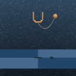
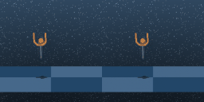

# Dreamer V4 — from-scratch PyTorch reproduction

[](https://arxiv.org/abs/2509.24527)
[](LICENSE)
[](https://huggingface.co/vijayabhaskarev/dreamer-v4)

A faithful, from-scratch PyTorch implementation of **DreamerV4** (Hafner, Yan & Lillicrap, DeepMind, 2025 — [arXiv:2509.24527](https://arxiv.org/abs/2509.24527)): a model-based agent that learns by *imagining* trajectories inside a learned world model. All three phases are implemented and run end-to-end — tokenizer → flow-matching world model → behavior-cloned agent → imagination RL — and evaluated **closed-loop in the real environment**, not just inside imagination.

<p align="center">
  <br>
  <em>The trained agent catching and holding the ball (<code>ball_in_cup_catch</code>, stochastic policy).<br>It learns a real controller — this README is an honest teardown of where offline RL plateaus, and why.</em>
</p>

> **TL;DR.** I reproduced DreamerV4 end-to-end on `ball_in_cup_catch` and ran a rigorous real-env evaluation — then re-ran it properly: **six independent imagination-RL training runs, each evaluated on the same 500 seeded episodes.** Averaged over runs, **imagination RL beats behavior cloning by +5.9 points of catch rate** (95% CI [+1.5, +10.4], t(5)=3.40, 6/6 runs positive) and **+64 return**, split roughly evenly between *succeeding more often* and *succeeding sooner/holding longer*. The twist: **our own first single run showed no effect** (p=0.56 at n=500 episodes) — training-seed variance (±3.2 pts) is comparable to the effect itself, so single-run RL comparisons mislead *even with large eval budgets*. Coverage still caps the ceiling (best run 0.46 vs ~0.58 demo ceiling). Not SOTA — a small, verified, honestly-measured study.

---

## Results — `ball_in_cup_catch` (real-env, closed-loop; 6 training runs × 500 episodes)

Six independent Phase-3 (imagination-RL) training runs — identical recipe, different training seeds — each evaluated on the **same 500 fixed environment seeds** in live `dm_control` (action_repeat 2, ~500 policy decisions/episode, stochastic readout). All runs share one world model + reward/continue heads and initialize from the same BC checkpoint; **only Phase-3 training differs.** Every number below reproduces via `python -m analysis.paper_stats`.

**Catch rate** (fraction of 500 episodes that caught the ball; BC baseline **0.356**, random **0.094**):

| imagination-RL run | catch | Δ vs BC [95% CI] | paired sign-test p |
|---|:---:|:---:|:---:|
| run 1 (original) | 0.374 | +1.8 [−3.6, +7.2] | 0.56 |
| run 2 | 0.446 | +9.0 [+3.6, +14.4] | 0.002 |
| run 3 | 0.460 | +10.4 [+4.8, +16.0] | 0.001 |
| run 4 | 0.366 | +1.0 [−4.4, +6.4] | 0.77 |
| run 5 | 0.392 | +3.6 [−2.0, +9.0] | 0.23 |
| run 6 | 0.454 | +9.8 [+4.4, +15.4] | 0.001 |
| **mean of runs** | **0.415** | **+5.9 [+1.5, +10.4]**, t(5)=3.40 | p ≈ 0.02 |

**Return**: +63.6 on average (95% CI [+45.6, +81.7], 6/6 runs positive), decomposing into ~54% *catching more often* and ~46% *catching sooner / holding longer* (return per successful episode 501 → 582).

> **⚠️ Supersedes the earlier single-run result.** Previous versions of this README (and an accompanying Reddit/X write-up) reported a **single-run** n=50 comparison — BC 0.32 vs imagination-RL 0.38, paired p=0.63 — and concluded "imagination RL ≈ BC." That conclusion did not survive replication: the original training run turned out to be a below-average draw from a training distribution whose seed-to-seed spread (**±3.2 pts**) is comparable to the mean effect (+5.9). Three of six runs individually look like nothing (p ≥ 0.23) while the six-run average is decisively positive — **the training run, not the evaluation episode, is the unit of inference** for RL comparisons. We keep this note here deliberately: it is the project's most transferable lesson.

> **These are _offline_ numbers — read them against the demos, not online DreamerV3.** Online DreamerV3 reaches ~0.96 normalized return on cup-catch with millions of *self-collected* environment steps. This pipeline never touches the environment during training — it learns from a **fixed, mixed-quality demo set** (mean 0.58 normalized return; 39% expert, 26% genuinely poor), so the **offline ceiling here is ~0.58, not 0.96.** Even the best run (0.46) sits below that ceiling; closing the remaining gap is structurally an *online* (DAgger / online-RL) problem.

**Three findings:**

1. **Trained ≫ random.** BC 0.356 vs random 0.094 (paired sign test p ≈ 4×10⁻²⁸) — the world model + BC learn a genuine controller.
2. **Imagination RL improves on BC — on average, with real seed variance.** +5.9 pts catch / +64 return averaged over six runs, 6/6 positive; but per-run outcomes range from null (+1.0) to +10.4, so any *single* run can mislead.
3. **Deterministic collapses, stochastic acts.** Any deterministic readout ≈ 0.15–0.17; sampling ≈ 0.37–0.46. PMPO optimizes the *sampled* policy, so sampling is the training-consistent deployment — and a still agent drifts off the always-active expert's state distribution.

### The diagnosis — what limits and what varies

- **Coverage caps the ceiling.** The belief state is healthy **in-distribution** (its action mean ≈ the demos) and degrades only on **out-of-distribution** states the demos never covered; an advantage-weighted-BC probe found `corr(return, action-decisiveness) ≈ 0` (the expert is "always-on"), so offline re-weighting has nothing to exploit.
- **Training-seed variance is first-order.** Across-run spread of the catch-rate gain (sd 4.3 pts) exceeds what per-run evaluation noise alone predicts at n=500 (±2.8 pts) — implied genuine seed-to-seed sd ≈ **3.2 pts**, comparable to the mean effect.
- **Imagination compresses what reality separates.** Final *imagined* returns of the six runs span a narrow 74–78 band while their *real* catch rates span 0.366–0.460 — even after training, the world model cannot reliably tell you which policy is the strong one. Closed-loop evaluation is not optional.

### Readout ablation (zero-confound: one policy, read three ways; n = 30)

| readout | caught | why |
|---|:---:|---|
| `mean` (Σ pₖ·cₖ) | 0.17 | distribution mean |
| `argmax` (mode) | 0.17 | most-likely bin |
| `sample` | **0.47** | on-policy draw |

`mean ≈ argmax` to the decimal ⇒ the per-state conditionals are ~unimodal, so "deploy the mean, not the mode" **cannot** help. The collapse is the **deterministic-map / OOD-drift** effect — only sampling is robust to it, and the actor was *trained* on sampled actions, so sampling is the training-consistent deployment.

---

## The world model

<p align="center">
  <br>
  <em>Learned flow-matching world model — ground truth (left) vs the model's autoregressive prediction (right), decoded to pixels.</em>
</p>

The dynamics model is a 12-layer block-causal transformer trained with a **flow-matching** objective (+ bootstrap loss + curriculum) to denoise future latents given past latents, actions, and the (τ, d) flow parameters. Agent tokens read the world-model state through an asymmetric attention mask so the policy can be trained without contaminating the frozen world model.

---

## Quickstart — reproduce the result

```bash
git clone https://github.com/vijayabhaskar-ev/dreamer_v4.git && cd dreamer_v4
pip install -r requirements.txt
pip install dm_control mujoco            # for the real-env eval
export MUJOCO_GL=egl                     # headless render (osmesa on CPU-only hosts)

# pull the pretrained checkpoints (~814 MB) from the Hugging Face Hub
hf download vijayabhaskarev/dreamer-v4 --include "ball_in_cup/*" --local-dir checkpoints-hf

# reproduce the headline table (random vs BC vs imagination-RL)
python -m dynamics.evaluate_env \
  --phase2-ckpt    checkpoints-hf/ball_in_cup/agent_bc.pt \
  --phase3-ckpt    checkpoints-hf/ball_in_cup/agent_imagination_rl.pt \
  --tokenizer-ckpt checkpoints-hf/ball_in_cup/tokenizer.pt \
  --task ball_in_cup_catch --action-dim 2 \
  --num-episodes 50 --policies phase3,bc,random \
  --device cuda --readout sample --wandb-disabled --output-dir eval-stoch    # --readout argmax → deterministic column
```

Expected: `random` ≈ 0.10 ≪ `bc` ≈ 0.32, `phase3` ≈ 0.38 (catch rate; exact on same hardware — the eval is seed-deterministic). Note this reproduces the **released checkpoint** (training run 1 of 6); the headline result averages six runs — see the Results table, and `run_seed_study.sh` + `analysis/paper_stats.py` to reproduce the full study. Outputs land in `eval-stoch/`.

### Pretrained checkpoints

Hosted on the Hub at [`vijayabhaskarev/dreamer-v4`](https://huggingface.co/vijayabhaskarev/dreamer-v4) — inference-only (optimizer state stripped).

| file | what it is | size |
|---|---|---|
| `ball_in_cup/tokenizer.pt` | masked-autoencoder tokenizer (128×128) | 300 MB |
| `ball_in_cup/agent_bc.pt` | BC agent — world model + categorical policy + reward/continue heads | 507 MB |
| `ball_in_cup/agent_imagination_rl.pt` | imagination-RL policy + value heads (loads **on top of** `agent_bc`) | 7 MB |
| `ball_in_cup/world_model.pt` | world-model base, before agent finetuning — optional, only to retrain the agent | 491 MB |

> Dataset: derived from expert demos in [nicklashansen/dreamer4](https://github.com/nicklashansen/dreamer4); the data itself is not redistributed — regenerate it with `convert_hansen_to_npz.py`.

---

## Architecture at a glance

```
   raw frames (B, T, 3, H, W)            H = W = 128  (ball_in_cup_catch)
            │
            ▼
   ┌──────────────────────┐
   │  Tokenizer  (MAE)    │   spatial 8×8 patches → 32 latent tokens / frame
   │  encoder ─► z_clean  │   bottleneck latent_dim, tanh
   │  decoder ─► recon    │   loss = masked MSE + 0.2 · masked LPIPS
   └──────────┬───────────┘
              │ frozen after Phase 1
              ▼
   ┌──────────────────────┐
   │  Dynamics            │   12-layer transformer, embed_dim 512, GQA
   │  (flow matching)     │   spatial attn every layer, temporal every 4
   │  z_noised, τ, d, a   │   block-causal across time, sliding window C = 16
   │  ─► ẑ                │   loss = flow MSE + bootstrap (curriculum-mixed)
   │  + agent tokens ─► h │   asymmetric mask: agent sees all, world ignores agent
   └──────────┬───────────┘
              │
              ▼
   ┌──────────────────────┐
   │  Heads (on h)        │   reward:   255 symexp-twohot bins
   │                      │   continue: Bernoulli
   │                      │   value:    255 symexp-twohot bins  (Phase 3)
   │                      │   policy:   categorical (per-dim, 41 bins)  ← multimodal,
   │                      │             a drop-in for the paper's diagonal Gaussian
   └──────────┬───────────┘
              │
              ▼
   ┌──────────────────────┐
   │  Imagination loop    │   H = 15 steps, K = 4 Euler denoise sub-steps
   │  (Phase 3)           │   λ-returns (γ = 0.997, λ = 0.95)
   │                      │   PMPO policy loss (α = 0.5, β = 0.3, reverse KL)
   └──────────────────────┘
```

The three phases, in one line each:
- **Phase 1 — Tokenizer.** Spatio-temporal masked autoencoder; 8×8 patches → 32 latent tokens/frame; loss = masked MSE + 0.2·LPIPS; tube masking for temporal consistency.
- **Phase 2 — Dynamics + agent.** Block-causal flow-matching transformer with bootstrap-loss curriculum; agent tokens + multi-token-prediction heads (reward/continue/policy) are finetuned on top, **behavior-cloning** the demos.
- **Phase 3 — Imagination RL.** Freeze the world model; roll out H steps inside it; train policy + value heads with λ-returns and **PMPO** (preference-based MPO, reverse-KL to a frozen prior).

---

## Training from scratch

> **Dataset.** The eval above needs no data (it uses the checkpoints). To train from scratch, build the offline buffer from Hansen's cup-catch demos: get them from [nicklashansen/dreamer4](https://github.com/nicklashansen/dreamer4), arrange as `hansen_data/{expert,mixed-small,mixed-large}/` (each with `cup-catch-*.png` + `cup-catch.pt`), then convert to the project's `.npz`:
> ```bash
> python convert_hansen_to_npz.py --hansen-root hansen_data --out-path ball_in_cup_catch.npz
> ```
> Yields a 240-episode, **mixed-quality** buffer (mean ~0.57 normalized return — see [Results](#results--ball_in_cup_catch--real-env-closed-loop-n--50)). The data itself is not redistributed; only the conversion script is.

The training commands log to Weights & Biases by default — append `--wandb-disabled` to any of them to skip it.

```bash
# Phase 1 — tokenizer
python -m tokenizer.train_tokenizer --dataset offline --dataset-path data/episodes.npz --epochs 100 --batch-size 32

# Phase 2 — world model + BC agent (categorical policy head)
python -m dynamics.train_agent \
  --dynamics-ckpt checkpoints/dynamics/base.pt --tokenizer-ckpt checkpoints/tokenizer/final.pt \
  --dataset offline --dataset-path ball_in_cup_catch.npz --task ball_in_cup_catch --action-dim 2 \
  --policy-type categorical --policy-num-bins 41 --mtp-length 8 \
  --epochs 40 --steps-per-epoch 500 --batch-size 32 --amp

# Phase 3 — imagination RL
python -m imagination.train_imagination \
  --phase2-ckpt checkpoints/agent/final.pt --tokenizer-ckpt checkpoints/tokenizer/final.pt \
  --dataset offline --dataset-path ball_in_cup_catch.npz --action-dim 2 \
  --policy-type categorical --epochs 15 --batch-size 48 --horizon 15
```

Unit tests (run from the project root):
```bash
python -m tests.test_imagination_algorithms   # λ-returns / advantages / value loss / PMPO
python -m tests.test_imagination_rollout       # imagine_rollout output contract + grad isolation
python -m tests.test_gradient_isolation        # forward-mask firewall: z_hat ⊥ agent token
```

---

## Repository layout

```
dreamer_v4/
├── tokenizer/         Phase 1 — masked-autoencoder tokenizer (model, masking, losses, trainer)
├── dynamics/          Phase 2 — flow-matching world model + agent finetuning + real-env eval
│   ├── dynamic_model.py    transformer + register/agent tokens
│   ├── flow_matching.py    add_noise, on-device (τ, d) sampling
│   ├── trainer.py          curriculum, MTP, behavior cloning
│   ├── evaluate_dynamics.py   world-model rollout GIFs + per-τ metrics
│   └── evaluate_env.py        ← closed-loop real-env eval (the results above)
├── imagination/       Phase 3 — imagine_rollout, λ-returns, PMPO, trainer
├── heads.py           reward / continue / value / policy heads (Gaussian + categorical)
├── convert_hansen_to_npz.py    build the offline dataset from Hansen's demos
├── tests/             imagination algebra, rollout contract, mask-firewall checks
└── requirements.txt
```

---

## What's noteworthy in this implementation

- **Categorical policy head** (`heads.py`) — a per-dim discretized (41-bin) head, a multimodal drop-in for the paper's diagonal Gaussian, with a head-agnostic `act(readout=mean|argmax|sample)` deployment interface. The readout ablation above is run through it.
- **Asymmetric agent-token mask** (`dynamics/dynamic_model.py`) — adds an agent stream to a pretrained world model without leaking agent state into world-model predictions. This forward-mask firewall is unit-tested: `tests/test_gradient_isolation.py` confirms `∂z_hat/∂agent_token = 0` exactly, while the agent stream still reads the world.
- **On-device flow-matching RNG** (`dynamics/flow_matching.py`) — keeps the training step on the accelerator, no per-step host sync.
- **PMPO** (`imagination/algorithms.py`) — preference-based MPO with reverse KL to a frozen prior, partitioned by advantage sign rather than softmax weights; λ-returns detached at the source.
- **Closed-loop real-env evaluator** (`dynamics/evaluate_env.py`) — the world model acts as a belief encoder (no denoising loop); three policies compared on identical seeds; full calibration + GIFs.

---

## Honest limitations

- This is a **single, simple task** (`ball_in_cup_catch`), trained **fully offline** from a fixed, mixed-quality demo set — the relevant ceiling is the demos (~0.58 normalized return), **not** online DreamerV3's ~0.96. Not a state-of-the-art agent.
- The headline (+5.9 pts, 95% CI [+1.5, +10.4]) averages **six training runs against one BC training run**; BC's own seed variance is unmeasured, and per-run outcomes range from null to +10.4 pts. Claims are about *this recipe on this task*, not offline MBRL in general.
- Earlier versions of this README reported a single-run null ("imagination-RL ≈ BC, p=0.63"); it is superseded by the six-run study above — kept visible as the project's main methodological lesson.
- Distributed/multi-GPU training is not implemented; the code targets single-GPU CUDA.
- Checkpoints embed `dynamics_cfg`/`imagination_cfg` dataclasses — load them with the repo importable (run from the repo root, as the commands above do).

---

## References

- Hafner, Yan, Lillicrap — *Training Agents Inside of Scalable World Models* (DreamerV4). [arXiv:2509.24527](https://arxiv.org/abs/2509.24527), 2025.
- Hafner et al. — *Mastering Diverse Domains through World Models* (DreamerV3). [arXiv:2301.04104](https://arxiv.org/abs/2301.04104), 2023.
- Lipman et al. — *Flow Matching for Generative Modeling*, 2023.
- Abdolmaleki et al. — *Maximum a Posteriori Policy Optimization* (MPO), 2018.

## Citation

Independent reproduction — please cite the original DreamerV4 paper; optionally cite this repo:

```bibtex
@article{hafner2025dreamerv4,
  title   = {Training Agents Inside of Scalable World Models},
  author  = {Hafner, Danijar and Yan, Wilson and Lillicrap, Timothy},
  journal = {arXiv preprint arXiv:2509.24527},
  year    = {2025}
}

@software{eswaran2026dreamerv4,
  title  = {Dreamer V4 --- from-scratch PyTorch reproduction},
  author = {Eswaran, Vijaya Bhaskar},
  year   = {2026},
  url    = {https://github.com/vijayabhaskar-ev/dreamer_v4}
}
```

## License

MIT — see [`LICENSE`](LICENSE).
